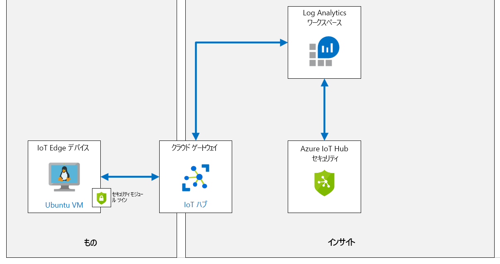

---
lab:
    title: 'ラボ 19: IoT デバイスが Azure Security Center for IoT に改ざんされているかどうか検出'
    module: 'モジュール 10: Azure Security Center と IoT セキュリティ'
---

# Azure Security Center for IoTでのデバイス改ざんの検出

## ラボシナリオ

Contoso は、セキュリティを考慮してすべてのソリューションを構築しました。ただし、Azure IoT ソリューションを含め、オンプレミスとクラウドのすべてのワークロード全体で、セキュリティに関する統合された表示方法を実装したいと考えています。さらに、新しいデバイスをオンボードする場合、同社はセキュリティ標準への準拠とセキュリティ体制の向上を確実にするために、ワークロード (リーフ デバイス、Microsoft Edge デバイス、IoT Hub) にセキュリティ ポリシーを適用することを検討しています。

Contoso は、新規注文に対応する出荷と梱包および要求の拡大化を図るため、新しい IoT デバイスを備えた新しいアセンブリ ラインを追加しています。新しいデバイスがセキュリティで保護されていることと、ソリューションのセキュリティを継続的に向上させるのに役立つ、セキュリティに関する推奨事項を確認する必要があります (完全なエンドツーエンド IoT ソリューションを検討)。ソリューションに対する Azure IoT Center for IoT の使用について調査を開始します。

また、Contoso はさまざまなチーズ熟成洞窟の温度を監視し制御する機能を向上させる、新しく接続されたサーモスタットも設置しています。Contoso のセキュリティ要件の一部として、サーモスタットがテレメトリ送信の想定頻度を超えているかどうかを監視するカスタム アラートを作成します。

次のリソースを作成する予定です。



## このラボの内容

このラボでは、次のタスクを正常に達成します。

* ラボの前提条件を確認する
* IoT Hub を作成する
* IoT 用の Azure Security Center を有効にする
* 新しいデバイスを作成して登録する
* セキュリティ モジュール ツインを作成する
* Linux デバイスに C# ベースのセキュリティ エージェントをインストールする
* ソリューションの構成
* カスタム アラートの構成
* 警告をトリガーするコンソール アプリを作成する
* Azure Security Center で警告を確認する

## ラボの手順

### 演習 1: ラボの前提条件を確認する

このラボでは、次の Azure リソースが使用可能であることを前提としています。

| リソースの種類:  | リソース名 |
| :-- | :-- |
| リソース グループ | AZ-220-RG |
| IoT Hub | AZ-220-HUB-{YOUR-ID} |

これらのリソースが利用できない場合は、演習 2 に進む前に、以下の手順に従って **lab19-setup.azcli** スクリプトを実行する必要があります。スクリプト ファイルは、開発環境構成 (ラボ 3) の一部としてローカルに複製した GitHub リポジトリに含まれています。

> **注意**: **lab19-setup.azcli** スクリプトは、**bash** シェル環境で実行するように記述されています。Azure Cloud Shell で実行するのに最も簡単な方法です。

1. ブラウザーを使用して [Azure Cloud Shell](https://shell.azure.com/) を開き、このコースで使用している Azure サブスクリプションでログインします。

1. Cloud Shell のストレージの設定に関するメッセージが表示された場合は、デフォルトをそのまま使用します。

1. Azure シェルが **Bash** を使用していることを確認します。

    「Azure Cloud Shell] ページの左上隅にあるドロップダウンは、環境を選択するために使用されます。選択されたドロップダウンの値が **Bash**であることを確認します。 

1. Azure Shell ツール バーで、「**ファイルのアップロード/ダウンロード**」をクリックします(右から 4番目のボタン)。

1. ドロップダウンで、「**アップロード**」 をクリックします。

1. ファイル選択ダイアログで、開発環境を構成したときにダウンロードした GitHub ラボ ファイルのフォルダーの場所に移動します。

    このコースのラボ 3 にあたる「開発環境のセットアップ」では、ZIP ファイルをダウンロードしてコンテンツをローカルに抽出することで、ラボ リソースを含む GitHub リポジトリを複製しました。抽出されたフォルダー構造には、次のフォルダー パスが含まれます。

    * すべてのファイル
      * ラボ
          * 19 - IoT デバイスが Azure Security Center for IoT で改ざんされているかどうかを検出する
            * セットアップ

    lab19-setup.azcli スクリプト ファイルは、ラボ 19 のセットアップ フォルダにあります。

1. **lab19-setup.azcli** ファイルを選択し、「**開く**」 をクリックします。   

    ファイルのアップロードが完了すると、通知が表示されます。

1. 正しいファイルがアップロードされたことを確認するには、次のコマンドを入力します。

    ```bash
    ls
    ```

    `ls` コマンドを使用して、現在のディレクトリの内容を表示します。一覧にある lab19-setup.azcli ファイルが表示されるはずです。

1. セットアップ スクリプトを含むこのラボのディレクトリを作成し、そのディレクトリに移動するには、次の Bash コマンドを入力します。

    ```bash
    mkdir lab19
    mv lab19-setup.azcli lab19
    cd lab19
    ```

    これらのコマンドは、このラボのディレクトリを作成し、**lab19-setup.azcli** ファイルをそのディレクトリに移動させて、ディレクトリを変更して新しいディレクトリを現在の作業ディレクトリにします。 

1. **lab19-setup.azcli** に実行権限があることを確認するには、次のコマンドを入力します。 

    ```bash
    chmod +x lab19-setup.azcli
    ```

1. Cloud Shell ツールバーで、**lab19-setup.azcli** ファイルを編集するには、「**エディタを開く**」 (右から 2 番目のボタン - { }) をクリックします。   

1. 「**ファイル**」 ボックスの一覧で lab19 フォルダを展開し、「**lab19**」、「**lab19-setup.azcli**」 の順にクリックします。    

    エディタにより **lab19-setup.azcli** ファイルの内容が表示されます。 

1. エディターで、`{YOUR-ID}` と `{YOUR-LOCATION}` 変数の値を更新します。

    例として以下のサンプルを参照し、このコースの開始時に作成した一意の ID、つまり **CAH191211** に `{YOUR-ID}` を設定し、リソース グループと一致する場所に `{YOUR-LOCATION}` を設定する必要があります。

    ```bash
    #!/bin/bash

    RGName="AZ-220-RG"
    IoTHubName="AZ-220-HUB-{YOUR-ID}"

    Location="{YOUR-LOCATION}"
    ```

    > **注意**:  `{YOUR-LOCATION}` 変数は、すべてのリソースをデプロイするリージョンの短い名前に設定する必要があります。次のコマンドを入力すると、使用可能な場所と短い名前 (「**名前**」 の列) の一覧を表示できます。
    >
    > ```bash
    > az account list-locations -o Table
    >
    > DisplayName           Latitude    Longitude    Name
    > --------------------  ----------  -----------  ------------------
    > East Asia             22.267      114.188      eastasia
    > Southeast Asia        1.283       103.833      southeastasia
    > Central US            41.5908     -93.6208     centralus
    > East US               37.3719     -79.8164     eastus
    > East US 2             36.6681     -78.3889     eastus2
    > ```

1. エディター画面の右上で、ファイルに加えた変更を保存してエディタを閉じるには、「..」 をクリックし、「**エディタを閉じる**」 をクリックします。 

    保存を求められたら、「**保存**」 をクリックすると、エディタが閉じます。 

    > **注意**:  **CTRL+S**を使っていつでも保存でき、 **CTRL+Q**を押してエディターを閉じます。

1. このラボに必要なリソースを作成するには、次のコマンドを入力します。

    ```bash
    ./lab19-setup.azcli
    ```

    これは、実行するのに数分かかります。各ステップが完了すると、JSON 出力が表示されます。

### 演習 2: Azure Security Center for IoT Hub を有効にする

Azure Security Center for IoT を使用すると、セキュリティ管理を統一したり、ハイブリッド クラウド ワークロードと Azure IoT ソリューション全体でエンド ツー エンドの脅威の検出および分析を行ったりできます。

Azure Security Center for IoT は、次のコンポーネントで構成されます。

* IoT Hub の統合
* デバイス エージェント (省略可能)
* セキュリティ メッセージ SDK の送信
* 分析パイプライン

#### タスク 1: Azure Security Center for IoT を有効にする

このタスクでは、IoT Hub 用の **Azure Security Center for IoT** を有効にします。 

1. 必要に応じて、Azure アカウントの認証情報を使用して Azure portal にログインします。

    複数の Azure アカウントをお持ちの場合は、このコースで使用するサブスクリプションに関連付けられているアカウントでログインしていることを確認してください。

1. Azure ダッシュボードで、「**AZ-220-HUB-{YOUR-ID}**」 をクリックします。

    ダッシュボードには、AZ-220-RG リソース グループ タイルの IoT Hub へのリンクが必要です。

1. 左側のナビゲーション メニューにある 「**セキュリティ**」 の 「**概要**」 をクリックします。   

    Azure Security Center for IoT Hub は、セキュリティ ウィンドウが初めて開くとオンボードされます。 
    
    * 「**IoT ソリューションをセキュリティで保護する**」 をクリックするよう求められる場合があります。
    * しばらくすると、「**この IoT Hub のオンボーディングを成功しました。有効にするには更新してください**」というメッセージが表示される場合があります。

1. 時間をとって 「セキュリティの概要」 ウィンドウのコンテンツを確認します。

#### タスク 2: Log Analytics の作成

Azure Security Center for IoT が有効になっている場合は、既定の Azure Log Analytics ワークスペースが作成されて、IoT デバイス、IoT Edge、IoT Hub の未処理のセキュリティ イベント、アラート、推奨事項が保存されます。

このタスクでは、Log Analytics のワークスペース構成をさらっと確認します。

1. 必要に応じて、IoT Hub の 「セキュリティの概要」 ウィンドウを開きます。

1. ブレードの上部にある 「**設定**」 をクリックして、セキュリティ設定を表示します。 

    「**設定**」 ブレードが開き、「**データ収集**」 ウィンドウが表示されます。 

1. 少し時間をとって、表示された設定情報を確認してください。

    Log Analytics ワークスペースに定義されている**ワークスペース構成**に注目してください。

既定では、Azure Security Center for IoT ソリューションを有効にすると、Azure サブスクリプションのすべての IoT Hub が自動的にセキュリティで保護されます。

### エクササイズ 3: 新しいデバイスの作成と登録

この演習では、仮想マシンをセットアップし、IoT デバイスのシミュレーションに使用します。このラボの後半では、このデバイスを使用してコンベア ベルトの振動を測定します。

#### タスク 1: 新しい IoT デバイスを作成する

このタスクでは、IoT デバイスを表す VM を作成します。

1. Azure アカウントの資格情報を使用して [portal.azure.com](https://portal.azure.com) にログインします。

1. ポータル メニューで 「**リソースの作成**」 をクリックし、次にマーケットプレースで **Ubuntu Server 18.04 LTS** を検索します。

1. 検索結果で、「**Ubuntu Server 18.04 LTS**」 をクリックします。

1. 「**Ubuntu Server 18.04 LTS**」 ブレードで、「**作成**」 をクリックします。

1. 「**仮想マシンの作成**」 ブレードの 「**サブスクリプション**」 で、このコースに使用するサブスクリプションが選択されていることを確認します。

1. 「**リソース グループ**」 ドロップダウンで、「**新規作成**」 をクリックします

1. コンテキスト メニューの 「**名前**」 で、**AZ-220-SECVM-RG** と入力し、「**OK**」 をクリックします。

    > **注意**: ベスト プラクティスは、VM のリソース グループを作成することです。これにより、VM に対して追加/作成する追加リソースを追跡できます。このコースの簡単なユース ケースでは、クリーンアップの容易さが主な利点ですが、ラボの後半で、このリソース グループを使って、もう少し説明します。

1. 「**仮想マシン名**」 テキスト ボックスに **vm-device01** と入力します。

1. 「**リージョン**」 ドロップダウンで、最寄りの Azure リージョン、つまり Azure IoT Hub がプロビジョニングされているリージョンを選択します。 

1. 「**可用性オプション**」 ドロップダウンで、「**インフラストラクチャの冗長性が必要ありません**」 が選択されていることを確認します。

    > **ヒント**:
    > Azure では、アプリケーションの可用性と回復性を管理するさまざまなオプションを提供します。可用性ゾーンまたは可用性セットでレプリケートされた VM を使用して、データセンターの停止やメンテナンス イベントからアプリとデータを保護するソリューションを設計します。このラボでは、高可用性機能は必要ありません。

1. 「**イメージ**」 ドロップダウンで、**Ubuntu Server 18.04 LTS** が選択されています。

1. 「**Azure スポット インスタンス**」 フィールドで、「**いいえ**」 が選択されていることを確認します。   

    > **ヒント**:
    > スポット VM を使用すると、コストを大幅に減らして Azure の未使用の容量を活用できます。Azure で元の容量に戻す必要が生じた時点で、Azure インフラストラクチャはスポット VM を削除します。したがって、スポット VM は、バッチ処理ジョブ、開発/テスト環境、大規模なコンピューティング ワークロードなどの中断を対処できるワークロードに最適です。このラボには、従来の VM を使用します。

1. 「**管理者アカウント**」 の 「**認証の種類**」 の右側で、「**パスワード**」 をクリックします。     

1. 管理者の 「**ユーザー名**」 フィールドと 「**パスワード**」 フィールドで、VM 管理者アカウントの値を入力します。

    > **重要**: VM 管理者のユーザー名とパスワードをメモします。運用環境では、これらをセキュリティで保護する必要があります。このラボの場合は、忘れるといけないので、後で確認できるように値をテキスト ドキュメントに保存しても構いません。 

1. 「**受信ポートの規則**」 の右側で、「**SSH (22)**」 が選択されていることに注意します。   

    VM を構成または管理する必要がある場合に、SSH を使用して VM にリモートでアクセスします。

1. ブレードの最下部で、**「レビュー + 作成」**をクリックします。

1. 「検証が成功しました」というメッセージを確認したら、「**作成**」 をクリックします。

    > **注意**:
    > デプロイを完了するには約 5 分かかります。デプロイ中は、次のユニットに進むことができます。

#### タスク 2: 新しいデバイスを登録する

接続する前に IoT Hub にデバイスを登録する必要があるため、その登録を作成します。

1. Azure portal メニューで、**「ダッシュボード」** をクリックします。

1. AZ-220-RG リソース グループのタイルで、**AZ-220-HUB-{YOUR-ID}** をクリックします。

    IoT Hub ブレードを開く方法は他にもたくさんありますので、ご希望のメソッドをどれでも使用してください。

1. 左側のナビゲーション メニューで、「**エクスプローラ**」 の下の 「**IoT デバイス**」 をクリックします。   

1. 「**IoT デバイス**」 ウィンドウの上部で、「**新規**」 をクリックします。

1. 「**デバイス ID**」 の下に「**vm-device01**」と入力します。

    はい、デバイス ID として VM に割り当てた名前を使用しています。

    **対称キー** を認証に使用するので、他の設定はデフォルトのままにします。 

1. ブレードの上部にある 「**保存**」 をクリックします。

### 演習 4: セキュリティ モジュール ツインを作成する

Azure Security Center for IoT では、既存の IoT デバイス管理プラットフォームとの完全な統合が提供されるため、デバイスのセキュリティ状態を管理したり、既存のデバイス制御機能を使用したりできます。

Azure Security Center for IoT は、モジュール ツイン メカニズムを使用し、各デバイスに対して azureiotsecurity という名前のセキュリティ モジュール ツインを保持します。セキュリティ モジュール ツインは、各デバイスのデバイス セキュリティに関連するすべての情報を保持します。Azure Security Center for IoT の機能を最大限に活用するには、新しい IoT Edge デバイスに対して、これらのセキュリティ モジュール ツインを作成、構成、および使用する必要があります。

セキュリティ モジュール ツイン (**azureiotsecurity**) は、次のいずれかの方法を使用して作成できます。

* [モジュール バッチ スクリプト](https://github.com/Azure/Azure-IoT-Security/tree/master/security_module_twin)を使用します。  このスクリプトにより、既定の構成を使用して、新しいデバイス (またはモジュール ツインのないデバイス) 用のモジュール ツインを自動的に作成します。
* 各デバイスに特有の構成を使用して、個別に各モジュール ツインを手動で編集します。

このタスクでは、セキュリティ モジュール ツインを手動で作成します。

1. Azure portal で、必要に応じて、IoT Hub の 「**IoT デバイス**」 ウィンドウに移動します。

    「IoT Hub」 ブレードから 「**IoT デバイス**」 ウィンドウを開くには、左側のナビゲーション メニューの 「**エクスプローラー**」 で 、「**IoT デバイス**」 をクリックします。

1. 「**デバイス ID**」 の下にある 「**vm-device01**」 をクリックします。

1. 「**vm-device01**」 ブレードで、ブレードの上部近くにある 「**モジュール ID の追加**」 をクリック します。

1. 「**モジュール ID の 追加**」 ウィンドウの 「**モジュール ID 名**」 で、**azureiotsecurity**と入力します。

    認証に対称キーを使用するので、すべてのフィールドを既定値のままにしておくことができます。

1. 画面の最下部で、「**保存**」 をクリックします。

    「**モジュール ID**」 に **azureiotsecurity** デバイスが一覧表示されます。接続状態は 「**切断済み**」 です。

    > **重要**: モジュール ID は、別の一意の名前ではなく、**azureiotsecurity** と呼ばれる必要があります。

    

1. 「**vm-device01**」 ブレードで、「**主キー**」 の右側にある 「**コピー**」 をクリックします。  

    > **注意**: 接続文字列ではなく、デバイスの**主キー**を必ずコピーしてください。

    

1. IoT Hub ブレードに戻ります。

1. 左側のナビゲーション メニューで、「**概要**」をクリックします。 

1. ブレードの上部近くにある 「Essentials」領域で、「**ホスト名**」の右側にある 「**クリップボードにコピー**」をクリックし、後で使用するために値を保存します。 

    > **注意**: IoT Hub ホスト名は次のようになります。AZ-220-HUB-CAH102119.azure-devices.net

### 演習 5: Azure Security Center for IoT C# セキュリティ エージェントのデプロイ

Azure Security Center for IoT では、IoT Hub を介してセキュリティ データのログをとり、処理、集計、送信を行うセキュリティ エージェント向けの参照アーキテクチャを提供します。C および C# ベースのエージェントがあります。C エージェントは、より制限されたまたは最小限のデバイス リソースを持つデバイスに推奨されます。

セキュリティ エージェントは、次の機能をサポートします。

* 基になるオペレーティング システム (Linux、Windows) から未加工のセキュリティ イベントを収集します。使用可能なセキュリティ データ コレクターの詳細については、「Azure Security Center for IoT エージェントの構成」を参照してください。
* 未加工のセキュリティ イベントを IoT Hub 経由で送信されるメッセージに集約します。
* 既存のデバイス ID または専用のモジュール ID で認証します。詳細については、「セキュリティ エージェントの認証方法」を参照してください。
* **azureiotsecurity** モジュール ツインを使って、リモートで構成します。詳細については、「Azure Security Center for IoT エージェントの構成」をご覧ください。

この演習では、シミュレーションされたデバイス (Linux VM) にデプロイする C# のセキュリティ エージェントを追加します。 

#### タスク 1: IoT デバイスへのログイン - Linux VM

1. 必要に応じて、Azure アカウントの認証情報を使用して Azure portal にログインします。

    複数の Azure アカウントをお持ちの場合は、このコースで使用するサブスクリプションに関連付けられているアカウントでログインしていることを確認してください。

1. Azure portal メニューで、「**すべてのリソース**」をクリックします。

    「**すべてのサービス**」ではなく 、「**すべてのリソース**」を必ず選択してください。

1. 「**すべてのリソース**」ブレードの 「**名前でフィルター**」テキストボックスに「**vm-device01**」と入力します。

1. 「**名前**」で **vm-device01** をクリックします。

    新しく作成した仮想マシン (**vm-device01**) の 「概要」ウィンドウが開くはずです。

1. ブレードの上部にある 「**接続**」をクリックし、「**SSH**」をクリックします。

1. 時間を割いて「**接続**」ウィンドウの内容を確認する

    このコースで既に説明したように、SSH 接続を開くためのコマンドの例を示します。

    コマンド例をテキスト エディターにコピーし、コマンドから `-i <private key path> を削除します。次の形式のコマンドが残る必要があります。

    ```cmd\sh
    ssh <admin user>@<ip address>
    ```

    コマンドは次のようになるはずです。`ssh demouser@52.170.205.79`

1. Azure portal のツール バーで、**「Cloud Shell」**をクリックします。

    Cloud Shell 内で **Bash** 環境が選択されていることを確認します。 

1. Cloud Shell コマンド プロンプトで、上で作成した `ssh` コマンドを入力し、**Enter** キーを押します。 

1. 「**接続を続行しますか?**」というメッセージが表示されたら、「**yes**」と入力して **Enter** キーを押します。   

    VM への接続を保護するために使用される証明書は自己署名されているので、このプロンプトはセキュリティの確認です。このプロンプトに対する答えは、その後の接続のために記憶され、最初の接続時にのみプロンプトが表示されます。

1. パスワードの入力を求められたら、VM 用に作成した管理者パスワードを入力します。

    接続すると、ターミナル コマンド プロンプトが変更され、Linux VM の名前が次のように表示されることに注意してください。

    ```cmd/sh
    demouser@vm-device01:~$
    ```

    これにより、接続先の VM と現在のユーザーを追跡できます。

#### タスク 3: デバイスに対称キーを追加する

セキュリティ エージェントの C# バージョンを使用して IoT Hub に接続できます。接続を実装するには、デバイスの対称キーまたは認定資格証情報が必要です。

このラボでは、対称キーを認証として使用し、デバイス上の一時的なテキスト ドキュメントに格納する必要があります。

1. **vm-device01** デバイスの**主キー**値が使用可能であることを確認します。

    このラボでは、以前の主キー値を保存しておく必要があります。そうでない場合は、次の手順を実行します。

    1. 新しいブラウザー タブを開き、新しいタブで、Azure portal に移動します。
    1. 「Azure portal」メニューで、「**ダッシュボード**」をクリック し、IoT Hub を開きます。
    1. 左側のナビゲーション メニューの 「**エクスプローラー**」で、「**IoT デバイス**」をクリックします。
    1. 「**デバイス ID**」の下にある 「**vm-device01**」をクリックします。
    1. 詳細の一覧から**主キー**をコピーします。
    1. Azure Cloud Shell ブラウザー タブを返します - **vm-device01** 仮想マシンに接続されている必要があります。

1. Cloud Shell コマンド プロンプトで、次のコマンドを入力します。

    ```cmd/sh
    echo "<primary_key>" > s.key
    ```

    このコマンドは、**vm-device01** デバイスの**主キー**を使用してデバイス認証タイプ ファイルを作成します。

    > 「!NOTE」 正しい主キーをファイルに追加したかどうかを確認するには、`nano s.key` コマンドを使用してファイルを開きます。デバイスの**主キー**がファイル内にあることを確認します。Nano エディターを終了するには、`Ctrl` キーと `X` キーを押し続けます。`Shift` キーと `Y` キーを押し続けて、ファイルを保存します。その後、「Enter」 キーを押します。

#### タスク 4: セキュリティ エージェントのインストール

1. Cloud Shell セッションが SSH 経由で VM に接続されていることを確認します。

1. Cloud Shell コマンド プロンプトで、C# 用セキュリティ エージェントの最新バージョンをデバイスにダウンロードするには、次のコマンドを入力します。

    ```bash
    wget https://github.com/Azure/Azure-IoT-Security-Agent-CS/releases/download/0.0.6/ubuntu-18.04-x64.tar.gz
    ```

1. Cloud Shell コマンド プロンプトで、パッケージの内容を抽出し、`/Install` フォルダーに移動するには、次のコマンドを入力します。

    ```bash
    tar -xzvf ubuntu-18.04-x64.tar.gz && cd Install
    ```

1. Cloud Shell コマンド プロンプトで、`InstallSecurityAgent` スクリプトに実行アクセス許可を追加するには、次のコマンドを入力します。

    ```bash
    chmod +x InstallSecurityAgent.sh
    ```

1. Cloud Shell コマンド プロンプトで、次のコマンドを入力します。 

    値を認証パラメーターに置き換える必要があります。

    ```bash
    sudo ./InstallSecurityAgent.sh -i -aui Device -aum SymmetricKey -f <Insert file location of your s.key file> -hn <Insert your full IoT Hub host name> -di vm-device01
    ```

    コマンドの例を次に示します。

    `sudo ./InstallSecurityAgent.sh -i -aui Device -aum SymmetricKey -f ../s.key -hn AZ-220-HUB-AB20200213.azure-devices.net -di vm-device01`

    > **注意**: 一覧表示されたホスト名ではなく IoT Hub のホスト名を必ず指定してください。 
    
    > **重要**:
    > `-hn` スイッチに値 IoT Hub の完全なホスト名、つまり **AZ-220-HUB-AB20200213.azure-devices.net** を使用していることを確認します。

    このスクリプトは、次の機能を実行します。

    * インストールの前提条件。
    * サービス ユーザーを追加します (対話型サインインが無効)。
    * エージェントをデーモンとしてインストールします - デバイスがサービス管理に **systemd** を使用していると仮定します。
    * エージェントが特定のタスクをルート ユーザーとして実行できるように **sudo ユーザー** を構成します。
    * 指定された認証パラメーターを使用してエージェントを構成します。

1. Cloud Shell ターミナルで出力を監視して、コマンドの進行状況を監視します。

    エージェントのインストールを完了するには、再起動が必要であることに注意してください。

1. Cloud Shell ターミナルで再起動を開始するには「**y**」と入力します。

    デバイスが再起動すると、SSH セッションは失われます。
 
1. Cloud Shell コマンド プロンプトで、仮想マシンに再接続するには、以前使用した SSH コマンドを入力します。

    Azure Security Center for IoT エージェントがアクティブになり実行されます。

1. Cloud Shell コマンド プロンプトで、Azure Security Center for IoT エージェントのデプロイ状態を確認するには、次のコマンドを入力します。 

    ```cmd/sh
    systemctl status ASCIoTAgent.service
    ```

    次のような出力が表示されます。

    ```log
    ● ASCIoTAgent.service - Azure Security Center for IoT Agent
       Loaded: loaded (/etc/systemd/system/ASCIoTAgent.service; enabled; vendor preset: enabled)
       Active: active (running) since Wed 2020-01-15 19:08:15 UTC; 3min 3s ago
     Main PID: 1092 (ASCIoTAgent)
        Tasks: 7 (limit: 9513)
       CGroup: /system.slice/ASCIoTAgent.service
            └─1092 /var/ASCIoTAgent/ASCIoTAgent
    ```

    具体的には、サービスが **読み込み済み: 読み込み済み**で、**アクティブ: アクティブ (実行中)**であることを確認する必要があります。

    > **注意**: Azure Security Center for IoT エージェントが実行されていないか、アクティブではない場合、[Linux 用の Azure Security Center for IoT の C# ベースのセキュリティ エージェントをデプロイする](https://docs.microsoft.com/en-us/azure/asc-for-iot/how-to-deploy-linux-cs) ガイドの「トラブルシューティング」セクションを確認してください。サービスを**アクティブ: アクティブ化中**のままにすることがある一般的な問題は、正しくないキー値であるか、完全な IoT Hub ホスト名を指定していないことです。

1. Azure portal で、IoT Hub のブレードに戻り、「**vm-device01**」 デバイス ブレードを開きます。

    IoT Hub のブレードを開き、ナビゲーション メニューの 「**エクスプローラー**」 で、「**IoT デバイス**」、「**vm-device01**」 の順にクリックします。

1. 「**モジュール ID**」 で、**azureiotsecurity** モジュールが**接続済み**状態になったことを確認します。

    

これで、Azure Security Center for IoT デバイス エージェントがデバイスにインストールされ、エージェントはデバイスから生のセキュリティ イベントを収集、集計、分析できるようになりました。

### 演習 6: ソリューション管理の構成

Azure Security Center for IoT は、Azure ベースの IoT ソリューションに包括的なエンド ツー エンド のセキュリティを提供します。

Azure Security Center for IoT を使用すると、IoT ソリューション全体を 1 つのダッシュボードで監視し、すべての IoT デバイス、IoT プラットフォーム、および Azure のバックエンド リソースを表示できます。

IoT Hub で有効にすると、Azure Security Center for IoT は、IoT Hub に接続され、IoT ソリューションに関連する他の Azure サービスを自動的に識別します。

自動リレーションシップ検出に加えて、IoT ソリューションの一部としてタグ付けする他の Azure リソース グループを選択することもできます。選択すると、サブスクリプション全体、リソース グループ、または単一のリソースを追加できます。

#### タスク 1:  IoT Hub を開く

1. ブラウザーで Azure portal を開き、IoT Hub に移動します。

1. 左側のナビゲーション メニューの 「**セキュリティ**」 で、「**リソース**」 をクリックします。

    リソースの一覧には、IoT Hub、Azure Security Center for IoT のアクティブ化が以前に行われたときに作成されたワークスペース、および現在のサブスクリプションが既に含まれていることに注意してください。

1. ウィンドウの上部にある 「**編集** をクリックします。

    「**ソリューション管理**」 ウィンドウが開き、所有するリソース グループを選択して、追加の Azure リソースをセキュリティ ソリューションに接続できます。

1. 「**サブスクリプション**」 で、このコースに使用するサブスクリプションが選択されていることを確認します。

    > **注:**
    > 複数のサブスクリプションのリソースをセキュリティ ソリューションに追加できます。

1. 「**リソース グループ**」 で、VM - **AZ-220-SECVM-RG** のリソース グループを選択します。

    これで、2 つのリソース グループが選択されます。追加したリソース グループの追加リソースを反映するように、「リソース」 リストが更新されたことに注意してください。

1. 「**ソリューション管理**」 ウィンドウの下部にある 「**適用**」 をクリックします。

    「**適用**」 ボタンが使用できない場合は、心配はいりません、リソースが既に追加されています。

1. 「**ソリューション管理**」 ウィンドウを閉じます。

すべてのリソース関係を定義した後、Azure Security Center for IoT は Azure Security Center を活用して、これらのリソースに対するセキュリティに関する推奨事項とアラートを提供します。

#### タスク 2: Azure Security Center for IoT の動作を表示する

これで、デバイスにセキュリティ エージェントがインストールされ、ソリューションが構成されました。Azure Security Center for IoT のさまざまなビューを確認することをお勧めします。

1. 左側のナビゲーション メニューの 「**セキュリティ**」 で、「**概要**」 をクリックします。 

    デバイス、ハブ、およびその他のリソースの正常性の概要が 2 つのグラフに表示されます。Azure Security Center for IoT を有効にしたときに有効になった、組み込みのリアルタイム監視、推奨事項、およびアラートを確認できます。

    

1. 左側のナビゲーション メニューの 「**セキュリティ**」 で、「**リソース**」 をクリックします。

    このウィンドウでは、IoT ソリューション全体でリソースの正常性にアクセスできます。

    > **重要**:
    > IoT リソースのセキュリティ構成を評価するプロセスは、実行に最大 24 時間かかる場合があるため、ダッシュボードに表示される初期状態は、リソースの実際の状態を反映していません。 

    次の図は、セキュリティ評価が実行された後のダッシュボードの状態を示しています。

    

### 演習 7: カスタム アラートの導入

カスタムのセキュリティ グループとアラートを使用すると、エンド ツー エンドのセキュリティ情報とカテゴリ別のデバイス知識を最大限に活用し、IoT ソリューション全体のセキュリティを確実に向上させます。これにより、ソリューションのセキュリティを強化できます。 

#### カスタム アラートを使用する理由

ご存知のとおり、IoT デバイスは、すぐに使用できるアルゴリズムよりも優れています。

予想されるデバイスの動作を完全に理解しているお客様の場合、Azure Security Center for IoT を使用して、この理解をデバイスの動作ポリシーに組み込み、予期される通常の動作からの逸脱について警告します。

#### タスク 1 - 警告をカスタマイズする

前述のように、ソリューションの特定の望ましい動作を理解しているお客様は、望ましい動作を超えたときにトリガーするカスタム警告を構成できます。この演習では、**MQTT** プロトコルを介して送信される**デバイスからクラウドへの**メッセージを監視するカスタム警告を作成します。

通常の状況では、Contoso のチーズ貯蔵庫監視システムは、IoT Hub の温度と湿度のデータを高速で送信しません。5 分間で、各デバイスが 1 ~ 5 個の device-to-cloud メッセージを送信することが予想されます。この範囲は、温度がより急速に変化する可能性があり、確立された境界値の外に値がずれないようにするために、より頻繁なデータが必要になる可能性がある夕暮れ時間に対応します。

このタスクでは、カスタム警告を作成します。

1. Azure portalで、IoT Hub ブレードに移動します。

1. 左側のナビゲーション メニューの 「**セキュリティ**」 で、「**カスタム警告**」 をクリック します。

1. 時間を割いて、「**カスタム警告**」 ウィンドウを確認します。

    一見すると、このウィンドウは空のように見える場合がありますが、「**名前**」 の下に表示される項目は、実際には **既定の**セキュリティ グループであり、自動的に作成されます。

    セキュリティ グループを使用すると、デバイスの論理グループを定義し、そのセキュリティ状態を集中管理できます。これらのグループは、特定のハードウェアを持つデバイス、特定の場所にデプロイされたデバイス、または特定のニーズに適したその他のグループを表す場合があります。

1. 既定のセキュリティ グループにカスタム警告を追加するには、「**既定**」 をクリックします。

    「**デバイス セキュリティ グループ**」 ブレードには、アクティブなすべてのカスタム警告が一覧表示されます。このブレードに初めてアクセスする場合は、空になります。

1. ブレードの上部にある 「**カスタム警告ルールの作成**」 をクリックします。 

    「**カスタム警告ルールの作成**」 ウィンドウが開きます。「**デバイス セキュリティ グループ**」 フィールドに**既定の**グループが入力されることに注意してください。

1. 「**カスタム警告**」 ドロップダウンで、「**デバイスからクラウドへのメッセージ (MQTT プロトコル) の数が許可された範囲にない**」 をクリックします。

    > **ヒント**:
    > 使用可能な多くのカスタム警告を確認します。ソリューションをセキュリティで保護するためにどのように使用できるかを検討してください。

    > **注意**:
    > 「**説明**」 および 「**必須プロパティ**」 は、選択した 「**カスタム警告**」 に応じて変更されます。

1. 「**必須プロパティ**」 の 「**最小しきい値**」 フィールドに「**1**」と入力します。

    これは、5 分間に少なくとも 1 つのメッセージが送信されるという期待を満たします。

1. 「**最大しきい値**」 に「**5**」と入力 します。

    これは、5 分間に送信されるメッセージが 5 個を超えないという期待を満たします。

1. 「**時間ウィンドウ サイズ**」 ドロップダウンで、**00:05:00** をクリックします。

    これは、確立された 5 分間を満たします。

    > **注意**:
    使用可能な時間枠は 4 つあります。
    > * 5 分
    > * 10 分
    > * 15 分
    > * 30 分

1. 「**カスタム警告ルールの作成**」 ウィンドウの下部にある 「**OK**」 をクリックします。

1. **既定の** (デバイス セキュリティ グループ) ブレードの上部にある 「**保存**」 をクリックします。

    新しい警告を保存せずに、次に IoT Hub を閉じると警告は削除されます。

    カスタム警告の一覧に戻ります。以下は、カスタム警告の数を示す画像です。

    

### 演習 8: デバイス アプリの構成

この演習では、IoT Hub デバイスと .Net Core コンソール アプリケーション (C#) を作成し、**Microsoft.Azure.Devices.Client** NuGet パッケージ利用して IoT Hub に接続します。コンソール アプリケーションは 10 秒ごとにテレメトリを送信し、(前の演習で作成した) カスタム警告で構成されたデバイスからクラウドへのメッセージのしきい値を超えるように設計されています。

#### タスク 1: 新しい IoT デバイスの登録

デバイスを接続する前には、IoT Hub　にデバイスを登録する必要があります。

1. 「Azure portal」 メニューで、「**ダッシュボード**」 をクリック し、IoT Hub を開きます。

1. 左側のナビゲーション メニューの 「**エクスプローラー**」 で、「**IoT デバイス**」 をクリックします。

1. 「**IoT デバイス**」 ウィンドウの上部で、「**新規**」 をクリックします。

1. 「**デバイスの作成**」 ブレードの 「**デバイス ID**」 で、「**CheeseCave1-Sensor1**」と入力します。

    **対称キー**を認証に使用するため、他の値は既定値のままにします。

1. ブレードの上部にある 「**保存**」 をクリックします。

1. 「**IoT デバイス**」 ウィンドウの 「**デバイス ID**」 で、「**CheeseCave1-Sensor1**」 をクリックします。

    **CheeseCave1-Sensor1** デバイスにアクセスするには、「**さらに読み込む**」 をクリックする必要があります。

1. 「**プライマリ接続文字列**」 の右側にある 「**コピー**」 をクリックし、値をテキスト ファイルに保存します。

    これが CheeseCave1-Sensor1 デバイスの接続文字列であることに注意してください。デバイス アプリの接続文字列値が必要です。

#### タスク 2: コンソール アプリを作成する

1. Visual Studio Code を起動します。

1. 「**ファイル**」 メニューで、「**フォルダーを開く**」 をクリックします。

1. 「**フォルダーを開く**」 ダイアログの上部にある 「**新規フォルダー**」 をクリックし、「**ThermostatDevice**」と入力して、「**Enter**」 キーを押 します。

    ラボ 19 フォルダーの下、またはお好みの別の場所に ThermostatDevice フォルダ－を作成できます。

1. 「**ThermostatDevice**」 をクリックし、「**フォルダーの選択**」 をクリック します。

1. 「**ファイル**」 メニューで、ファイルの自動保存が有効になっていることを確認するには、「**自動保存**」 をクリックします。

    複数のブロックのコードでコピーし、常に最新のファイルに対して操作していることを確認します。

1. 「**表示**」 メニューで、統合ターミナルを開くには、「**ターミナル**」 をクリックします。   

1. ターミナル コマンド プロンプトで、新しいコンソール アプリを作成するには、次のコマンドを入力します。

    ```bash
    dotnet new console
    ```

#### タスク 3: アプリを IoT Hub に接続する

1. ターミナル コマンド プロンプトで、必要な NuGet パッケージをインストールするには、次のコマンドを入力します。

    ```bash
    dotnet add package Microsoft.Azure.Devices.Client
    ```

1. エクスプローラー ウィンドウで、**Program.cs** をクリックします。

1. コード エディターで、既存のコードをすべて削除します。

1. コード エディターで、アプリで必要な `using` ステートメントを追加するには、次のコードを入力します。

    ```csharp
    using System;
    using Microsoft.Azure.Devices.Client;
    using Newtonsoft.Json;
    using System.Text;
    using System.Threading.Tasks;
    ```

1. `using` ステートメントの下に、アプリケーションの名前空間を作成するには、次のコードを入力します。

    ```csharp
    namespace ThermostatDevice
    {
        // ここにクラスを追加
    }
    ```

1. 以下の `// ここにクラスを追加` コメントの空白のコード行で、**ThermostatDevice** クラスを作成するには、次のコードを入力します。

    ```csharp
    class ThermostatDevice
    {
        // ここに変数を追加
    }
    ```

1. 以下の空白のコード行 `// ここに変数を追加` コメントで、デバイスの接続文字列の値を定義するには、次のコードを入力します。

    ```csharp
    private static DeviceClient s_deviceClient;
    private readonly static string s_connectionString = "<DEVICE-CONNECTION-STRING>";

    // ここに SendDeviceToCloudMessagesAsync メソッドを追加
    ```

    最初の行は、`DeviceClient` への参照を提供します
    2 行目は、デバイス接続文字列の変数を提供します (先ほどコピーした)。 

    > **ヒント**:
    > `<DEVICE-CONNECTION-STRING>` を、先ほど Azure portal からコピーしたデバイス プライマリ接続文字列に置き換えます。

1. i以下の空白のコード行 `// ここに SendDeviceToCloudMessagesAsync メソッドを追加` コメントで、デバイスを IoT Hub に対するクラウド メッセージを送信するには、次のコードを入力します。

    ```csharp
    private static async void SendDeviceToCloudMessagesAsync()
    {
        // 初期テレメトリ値
        double minTemperature = 20;
        double minHumidity = 60;
        Random rand = new Random();

        // ユーザーが Ctrl + C キーを押すまでループ
        while (true)
        {
            double currentTemperature = minTemperature + rand.NextDouble() * 15;
            double currentHumidity = minHumidity + rand.NextDouble() * 20;

            // 匿名型を使用して JSON メッセージを作成する
            var telemetryDataPoint = new
            {
                temperature = currentTemperature,
                humidity = currentHumidity
            };
            var messageString = JsonConvert.SerializeObject(telemetryDataPoint);
            var message = new Message(Encoding.ASCII.GetBytes(messageString));

            // メッセージにカスタム アプリケーション プロパティを追加.
            // IoT Hub は、メッセージ本文にアクセスしなくても、これらのプロパティをフィルター処理できます。
            message.Properties.Add("temperatureAlert", (currentTemperature > 30) ? "true" : "false");

            // テレメトリ メッセージの送信
            await s_deviceClient.SendEventAsync(message);
            Console.WriteLine("{0} > Sending message: {1}", DateTime.Now, messageString);

            // 次のメッセージを送信するまで 10 秒間待機する
            await Task.Delay(10000);
        }
    }

    // ここにメイン メソッドを追加
    ```

    上の `await Task.Delay(10000);` コードに注意してください。これにより、メッセージが 10 秒ごとに送信されるように時間の遅延が発生し、カスタム警告 アラートの "5 分間に 5 件以下のメッセージ" しきい値を超えます。

    > **ヒント**:
    > コード コメントを読んで、メソッドの動作を理解します。

1. `//ここにメイン メソッドを追加` コメントの下の空白のコード行に、アプリのメイン メソッド (エントリ ポイント) を提供するには、次のコードを入力します。

    ```csharp
    private static void Main(string[] args)
    {
        Console.WriteLine("IoT Hub C# Simulated Thermostat Device.CTRL+C to exit.\n");

        // MQTT プロトコルを使用して IIoT Hub に接続する
        s_deviceClient = DeviceClient.CreateFromConnectionString(s_connectionString, TransportType.Mqtt);
        SendDeviceToCloudMessagesAsync();
        Console.ReadLine();
    }
    ```

    > **注意**:
    `DeviceClient` インスタンスが作成されると、**MQTT** プロトコルは `TransportType.Mqtt` で指定されます - これにより、作成されたカスタム警告で指定されたプロトコルを使用して、デバイスからクラウドへのメッセージが確実に送信されます。

1. ターミナル コマンド プロンプトで、アプリケーションをビルドして実行するには、次のコマンドを入力します。

    ```bash
    dotnet run
    ```

    出力は、以下のようになります。

    ```text
    IoT Hub C# Simulated Thermostat Device. CTRL+C to exit.

    2/28/2020 1:32:21 PM > Sending message: {"temperature":25.7199231282435,"humidity":79.50078555359542}
    2/28/2020 1:32:31 PM > Sending message: {"temperature":21.877205091005752,"humidity":61.30029373862794}
    2/28/2020 1:32:41 PM > Sending message: {"temperature":21.245898961204055,"humidity":71.36471955634873}
    2/28/2020 1:32:51 PM > Sending message: {"temperature":32.61750500072609,"humidity":66.07430422961447}
    2/28/2020 1:33:01 PM > Sending message: {"temperature":31.100763578946125,"humidity":79.93955616836416}
    2/28/2020 1:33:11 PM > Sending message: {"temperature":25.02041019034591,"humidity":70.50569472392355}
    ```

    このラボの残りの部分では、アプリを実行したままにして、複数のアラートを生成できます。

### エクササイズ 9: Security Center の警告を確認する

この時点で、コンソール アプリは、以前に作成したカスタム警告をトリガーするのに十分なテレメトリを送信しています。 

> **ヒント**:
> この警告は、5 分以内にデバイスからクラウドに送信されたメッセージが 1 個未満または 6 個以上の場合にトリガーされるように設定されました。

#### タスク 1: Security Center ダッシュボードを確認する

1. Azure portal メニューで、「**ダッシュボード**」 をクリックし、IoT Hub を開きます。

1. 左側のナビゲーション メニューの 「**セキュリティ**」 で、「**概要**」 をクリックします。

    「**脅威の検出**」セクションをご覧ください。「**デバイス セキュリティ警告**」 グラフに 1 つ以上の警告が表示されます。

    

    「**Devices with the most alerts (アラートが最も多いデバイス)**」 タイルでも、 **CheeseCave1-Sensor1** デバイスのエントリが表示されるはずです。

    

    > 「!注意」
    > ダッシュボードにアラートが表示されるまで 10 ~ 15 分かかる場合があります。

1. 「**脅威検出**」 で、「**Devices with the most alerts (アラートが最も多いデバイス)**」 タイルをクリックします。

    これにより、左側のナビゲーション メニューの 「**セキュリティ**」 の下にある 「**セキュリティ アラート**」 をクリックした場合と同じ 「**警告**」 ブレードが開きます。

    セキュリティ アラートの一覧が表示されます。

    

    最新のアラートには**新しい**ラベルが付 きます。

1. 最新の警告をクリックします。

    詳細ウィンドウが開きます。「**全般情報**」 は、警告に関する概要情報を提供します。この下の**最後の 10 の影響を受けるデバイス**には、**CheeseCave1-Sensor1** デバイスが一覧表示されます。

    

1. Visual Studio Code に戻り、デバイス アプリを終了します。

    入力フォーカスをターミナル ウィンドウに配置し、**CTRL + C** キーを押して、アプリを閉じます。
